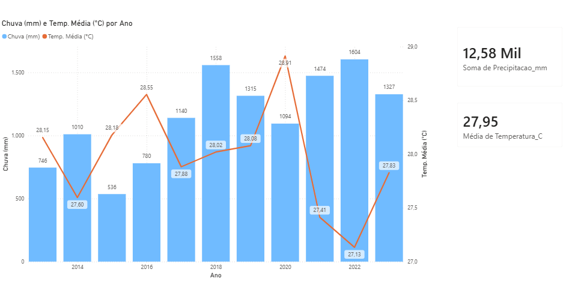

# 🌦️ Análise Climatológica: Teresina & Timon (2013-2023)

## 📊 Visão Geral do Dashboard



## 🎯 Objetivo

Analisar a série histórica de dados meteorológicos de Teresina (PI) e Timon (MA) ao longo da última década para responder às seguintes perguntas:

- O volume de chuvas está diminuindo?
- Existe correlação entre a seca e o aumento da temperatura?

## 🛠️ Tecnologias Utilizadas

- **Python (ETL)**: Script para leitura automatizada de múltiplos arquivos CSV, limpeza de dados (-9999), tratamento de tipos e agregação temporal.
- **Pandas & Glob**: Manipulação de grandes volumes de dados e estruturação de DataFrames.
- **Matplotlib**: Visualização exploratória (gráficos de eixo duplo).
- **Power BI**: Dashboard interativo para apresentação final e storytelling.

## ⚙️ Processo de ETL (Extração, Transformação e Carga)

O projeto seguiu um pipeline de dados rigoroso:

### Coleta
- Dados brutos obtidos do Portal do INMET.

### Processamento
- Unificação de 11 arquivos anuais (2013-2023).
- Correção de separadores decimais (vírgula para ponto).
- Remoção de outliers e dados inconsistentes.
- Tratamento de valores inválidos (-9999).

### Análise
- Criação das métricas:
  - Acumulado anual de chuva (soma).
  - Temperatura média anual (média).

### Exportação
- Geração de dataset limpo para consumo no Power BI.

## 📉 Insights e Resultados

### Recuperação Hídrica
- Após a seca severa entre 2013 e 2016 (média ~700 mm),
- Houve uma recuperação expressiva nos anos seguintes.
- Em 2022, foi registrado o maior volume de chuvas do período: **1.603 mm**.

### Correlação Chuva × Temperatura
- A chuva atua como regulador térmico.
- O ano mais chuvoso (2022) apresentou a menor temperatura média: **27,1 °C**.
- Os picos de temperatura ocorreram nos anos de menor pluviosidade.

## 🚀 Como Executar

Clone o repositório:
```bash
git clone https://github.com/seu-usuario/seu-repositorio.git
```

Instale as dependências:
```bash
pip install -r requirements.txt
```

Execute o notebook:
```bash
jupyter notebook
```

O arquivo tratado será gerado em:
```
processed_data/
```
